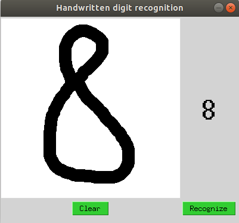
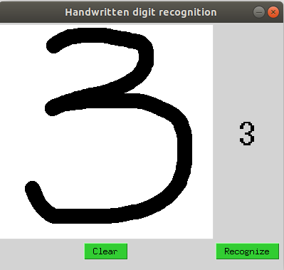
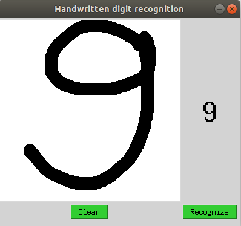
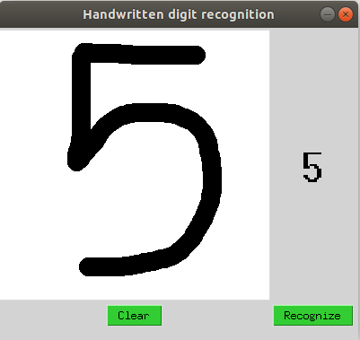

### Handwritten digit recognition
Resources used: Python, pandas, seaborn, matplotlib, tensorflow, keras, numpy, pyscreenshot, tkinter

*Model performance:*

Loss: 0.07141\
Accuracy: 0.98009

*Screenshots*\
\
\
\

