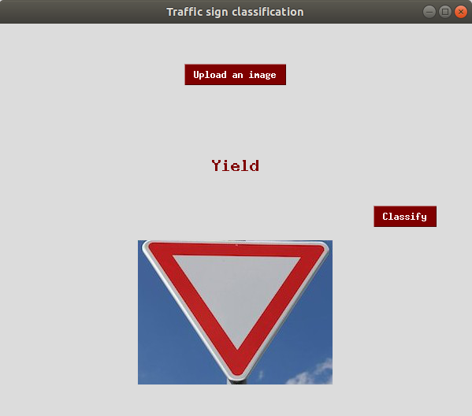
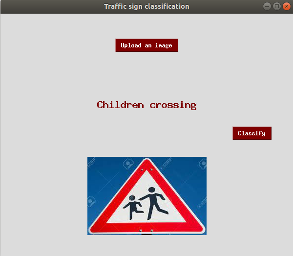
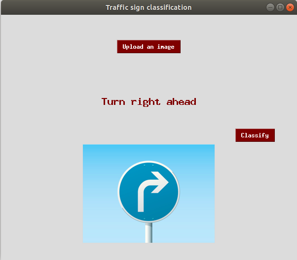

### Traffic signs recognition
Data source: [https://www.kaggle.com/meowmeowmeowmeowmeow/gtsrb-german-traffic-sign](https://www.kaggle.com/meowmeowmeowmeowmeow/gtsrb-german-traffic-sign)\
Resources used: Python, pandas, matplotlib, seaborn, tensorflow, keras, numpy, tkinter

*Model performance:*\
Accuracy: 0.9369

*Screenshots*\
\
\

